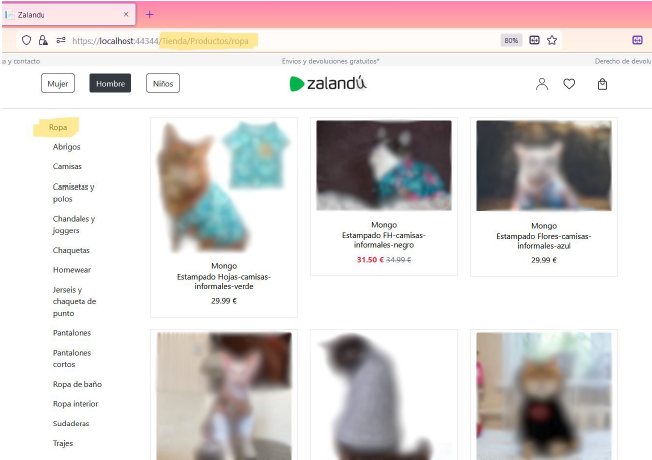

# blazor-web-clothestore
Aplicacion web: Comercio de ropa 

## **INTRODUCCIÓN** 
Lo que me llevó a decidir el enfoque de mi proyecto fue la idea de implementar el control de stock de un determinado producto. Entonces, ¿por qué hacerlo con ropa? La razón es que en clase trabajamos con  productos como libros y comida, más simples a la hora de manejar un control de stock, en cambio la ropa, al contar con una variedad de tallas por cada unidad de producto añade un plus de dificultad en la implementación al ser más factores a tener en cuenta. Por ello, me he inspirado en la web de[ zalando.es ](https://www.zalando.es/) a la hora de desarrollar y diseñar el portal. 

## **OBJETIVOS** 
El principal objetivo de este proyecto ha sido poner en práctica los conocimientos adquiridos  durante  el  curso,  utilizando  tecnologías  vistas  en  clase  además  de aprovechar la ocasión para profundizar en desarrollos que no tuvimos la ocasión de implementar. 

A  continuación  enumero  las  funcionalidades  más  importantes  que  se  pretenden cumplir con la realización del proyecto: 

* Control de *stock.* 
* Uso de transacciones. 
* *Treeview* dinámico y escalable.  
* Almacenar objetos y listas en tablas de base de datos mediante *EF*. 
* Uso de *state container* para la comunicación entre componentes. 
* Uso de *templated component.* 
* Sincronización entre los distintos elementos que conforman la aplicación. 
* Uso de *modales* y *badge* de *Bootstrap.* 

## **DESCRIPCIÓN DE LAS TECNOLOGÍAS UTILIZADAS**  
Para crear *Zalandú*, escogí la tecnología de *Blazor* apoyada en el *C#* y con escaso uso de JavaScript, únicamente para manejar en *localStorage,* y algún componente de *Bootstrap,* como los *alerts*, debido a la comodidad que proporcionan tanto el IDE propio  *VS*  como  la  potencia  *C#,*  facilitando  mucho  el  desarrollo.  Todo  ello  en *frontend*. 

En  *backend*  hago  uso  del  propio  servidor que  se  crea  por  defecto  al  iniciar  un proyecto *Blazor* en *VS*. 

La base de datos escogida es *SQL Server* que viene integrada con el *VS,* pero usando el *ORM*  *Entity Framework* para el acceso a datos.  

Para el diseño de las interfaces de usuario he utilizado *Bootstrap,* un *framework* *CSS.* 

## **FUNCIONALIDAD DEL PORTAL WEB** 
La funcionalidad de este es sencilla. Para comprar ropa se requiere de un registro previo. Yo he seguido la estrategia de permitir añadir productos al carrito sin la necesidad de estar *logueado* o registrado. Únicamente, se solicitará esta condición al cliente cuando trate de finalizar el pedido, ahí es cuando compruebo si el cliente está  *logueado*  o  no.  En  caso  afirmativo,  continua  el  proceso  para  completar  la compra si no, le redirecciono a la vista de *login*, que además cuenta con un botón de registro para que el usuario cumplimente el pertinente formulario. Una vez que el usuario esté *logueado*, aparecerá una vista donde se muestran los datos de envío del cliente; un formulario con campos requeridos que una vez cubierto permitirá finalizar el pedido. 

La idea es ir recabando los datos del cliente por etapas, primero en el registro y después en la finalización del pedido, creando así un registro rápido y sencillo para el cliente. 

Otra estrategia que he llevado a cabo es permitir que solo se pueda comprar un máximo de tres unidades por talla de cada producto, salvo en los casos en los que el stock sea inferior a esta cifra, entonces, la cota se pondrá en el valor del stock.  

Si un usuario trata de comprar un número mayor a estas dos cotas, se mostrará un *tab* o etiqueta de alerta; para ello use el componente *alert* de *Bootstrap*. 

## **DIAGRAMA DE BASE DE DATOS** 
Para la creación del diagrama de base de datos instalé las dependencias de *Visual Studio Build Tools*. En la siguiente captura se puede observar como solo represento aquellas tablas necesarias para el funcionamiento de mi aplicación, por tanto, omito las que se crean por defecto con *EF*. 

## **DESARROLLOS A DESTACAR** 
## ***TreeView*** 
El *treeview* está pensado para ser escalable, independientemente de las categorías o subcategorías que se le puedan añadir en un futuro desarrollo, se van a mostrar correctamente.  

**Ilustración 1: selección de la categoría “padre” “Ropa”** 

**Ilustración 2: selección de la categoría “hijo” “Camisas”** 

**Ilustración 3: selección categoría “nieto” “Camisas informales”** 

En las imágenes se puede apreciar como al seleccionar las distintas categorías y subcategorías,  la  lista  de  productos  va  variando,  manteniéndose  aquellos  que cumplen con el filtro. 

Este  es  el  bloque  de  código  con  más  algoritmia  de  toda  la  aplicación.  Para  la creación me he servido de un componente “recursivo” que he llamado “RecursiveUI".  Es un componente  que se invoca a sí mismo desde dentro del propio componente. Las variables intermedias ayudan a controlar que no se pinten todas las categorías y subcategorías  de  una  vez,  controlando  los  eventos  del  ratón  para  expandir  y colapsar el *treeview*.  

Vayamos al código: 

Estos dos componentes conforman el *treeview*.  

El componente “padre*”*, “PanelCategorias”, le pasa la lista de categorías que se ha recuperado de la base de datos, además del identificador, al componente hijo. Este último,  usará  el identificador  para  saber  por  qué  categoría  tiene que  empezar  a “pintar”. 

En este caso, el identificador será el valor 0 y se corresponderá a las categorías raíz: ropa, deporte, zapatos y complementos. Una vez encontrada la primera categoría, busca todas aquellas subcategorías “hijas*”* que coincidan con el identificador de esta categoría raíz y lo mismo pasaría con las categorías “nietas”, solo que cambiamos la condición anterior  por el identificador de las categorías “hijas”. 

## ***Productos, tallas y stock***  
Así se vería en la aplicación la vista con los detalles de un producto cualquiera:

El contenido de la vista es dinámico, desde la foto, la marca de ropa, el precio, hasta las tallas con su correspondiente precio y stock, del que solo muestro un mensaje de aquellas tallas que tengan un número de stock inferior a tres, y el contenido del componente *accordion* de *Bootstrap.*  

Vayamos por partes:  

### a) Tablas
Primero veremos cómo está almacenado el contenido dinámico en la base de datos. 

**Ilustración  4:  extracto  tabla  Productos.  Señalado  en  azul  el  producto  mostrado  en  la  vista** 

**anterior.** 

**Ilustración 5: tabla con el stock de cada talla del producto.** 

Un  producto  está  compuesto  por  varias  tallas  -  pueden  ser  de  dos  tipos: alfanuméricas o numéricas, aunque realmente son *string*-. Ahora bien, cada talla-producto ha de ser diferenciado ya que tienen un precio y stock distintos por eso, necesitamos ambas tablas.  

En  la  primera  cada registro único  corresponde  a  un  producto,  en  cambio,  en la segunda,  cada  registro  se  diferencia  por  una  clave  primaria  compuesta  por  los campo “ProductoId-Talla”. Esto es importante para llevar el control de stock que más adelante explicaré. 

### 2) Controlador 
El siguiente extracto de código muestra como enlazo los datos de ambas tablas almacenando  en  cada  producto  que  recupero  de  la  base  de  datos  sus correspondiente tallas con stock que luego pintaré en la vista.   

**Ilustración 6: bloque de código en 2ClienteController”** 

Esto es posible añadiendo una propiedad llamada “Stock” que he definido en el modelo Producto. Es una lista de objetos “StockProducto” que no se va a mapear contra la base de datos, pero nos permite tener toda la información en un único objeto.  

### 3) *State container* 
Otro criterio que he seguido es recuperar todos los productos de una tacada para no tener que hacer más peticiones al servidor cada vez que un usuario quiera ver la información detallada de un producto. Esto es posible al  utilizar la comunicación entre componentes. Para este caso en concreto me apoyo en un *state container*. 

Como podemos observar en el código, en el “StateContainerProducto” indicamos que componentes queremos que tengan acceso a los métodos del servicio.  

Veamos su uso en el componente:  

Este componente “hijo*”* recibe un objeto Producto pasado por el componente “padre” en cascada. A continuación, se envía al *state container* por medio de uno de sus  métodos “PassProducto” que ha sido inyectado. Una vez “almacenado” en el *state container,* podemos recuperarlo en otros componentes. No obstante, solo pueden ser    aquellos que he mencionado con anterioridad.  

El código para recuperar esos datos se ve da la siguiente forma: 

### 4) *Dropdown* tallas  

Para  el  *dropdown*  he  requerido  del  uso  de  un  *templated  component.*  Su implementación se ve de la siguiente manera: 

**Ilustración 7: fragmento de código del componente DetallesProducto** 

Este es como un mini bloque *html,* pero dinámico que se incrusta en la vista del componente. Así se vería implementado en la vista: 

**Ilustración 8: fragmento de código vista DetallesProducto** 

## ***Uso de Entity Framework***  
Para  la  creación  de  las  tablas  me  he  servido  de  *EF*,  lo  que  me  ha  permitido almacenar  tanto  objetos  como  colecciones  en  la  base  de  datos,  todo  ello serializados.  

La implementación para almacenar y recuperar listas es mucho más compleja que para objetos. Como podemos observar en la siguiente captura: 

En la base de datos lo almacena serializado como un *JSON* tal como se muestra aquí: 

Con objetos es más sencillo: 

En la tabla se vería así: 

## ***Control de stock y transacciones*** 
Una vez que el usuario finaliza la compra, se realiza una actualización de las tablas que  intervienen  en  el  proceso:  “PedidoCliente”,  “ItemsPedido”,  “StockProducto”. Como hay que lanzar varias operaciones de escritura sobre la base de datos, hago uso de las *transacciones* para que se grabe en todas las tablas haciendo *commit,* o 

en ninguna, con un *auto*-*rollback* en caso de una no deseable circunstancia externa. 

**Ilustración 9: fragmento de código del “ClienteController”** 

Simulo un *trigger* ya que *EF* no los “dispara”.  

## ***Badge***  
El *badge* es un componente de *Bootstrap* que uso para informar al usuario de que el producto ha sido añadido a la cesta además de informar de la cantidad total de estos.  

Aquí una comparativa visual del icono de la cesta sin compra y con la cesta llena. 

**Ilustración 10: *header* del *layout*** 

**Ilustración 11: fragmento código *html* del *Layout*** 

Lo más importante de esta implementación es que intervienen varios componentes: “\_Layout”, “DetallesProducto”, “MostrarPedido”.  

Todo esto ha de ser sincronizado para que la información sea consistente allá donde se  use.  Para  lograrlo,  hago  dos  cosas:  usar  el  *state  container*  -  necesario  sino perderíamos estos datos temporales- y pasar en cascada el *layout* -eso nos permite tener acceso a los métodos implementados en este-. 

El uso del objeto *\_\_Layout* en un componente se haría de la siguiente manera:  

 ## ***Alert tab y control de clics en botón comprar***  
El componente *alert* de *Bootstrap* se “dispara” cuando un usuario infringe la regla de negocio  que  he  mencionado  anteriormente.  Para  ello  hago  un  seguimiento  del número de clics que se hacen por talla de producto. 

Aquí  sí  que  he  necesitado  usar  código  JavaScript  para  mostrar  y  cerrar  esta etiqueta. Esto es posible gracias al mecanismo de interoperabilidad *JSRuntime* que provee *Blazor*. 

Llamo  a  mi  función   JavaScript  “alert”.  Esta  es  una  función  que  admite  tres parámetros: el mensaje de alerta que quiero que aparezca en la vista, el tipo de componente  *alert,*  en  mi  caso  *danger,*  y  por  último,  si  lo  quiero  hacer  visible  u ocultarlo. 
